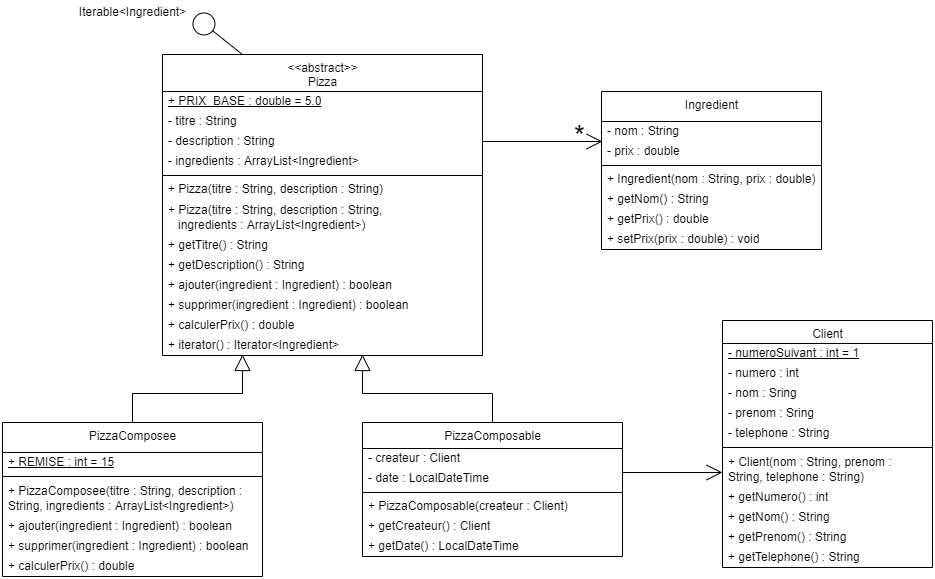

# Atelier 1 : Rappel orienté objet – partie 1

## Objectif

L'objectif de cet atelier est de réactiver les notions fondamentales de la programmation orientée objet en Java : création de classes, encapsulation, constructeurs, égalité structurelle, héritage, classes abstraites, redéfinition de méthodes, collections simples et gestion d'exceptions unchecked.

## Concepts

1. Classe et objet
2. Encapsulation
3. Attributs statiques
4. Constructeurs, surcharge et chaînage de constructeurs
5. Égalité référentielle et égalité structurelle
6. Redéfinition de `equals` et `hashCode`
7. Utilisation d'une `ArrayList`
8. Héritage et classes abstraites
9. Appel aux constructeurs et méthodes de la classe parent avec `super`
10. Redéfinition de méthodes (`overriding`)
11. Utilisation d'une méthode statique existante
12. Exceptions unchecked

## Vidéos

1. [Introduction au cours de Java avancé](https://www.youtube.com/watch?v=c69iGzsd1Pc)

## Exercices

### Introduction

Il s'agit d'implémenter une application de gestion de commandes de pizzas : la pizzeria en ligne.

L'application doit permettre de gérer les commandes de pizzas effectuées par des clients. Les pizzas sont composées soit par la pizzeria (ces pizzas sont appelées pizzas composées), soit par le client selon ses goûts (ces dernières sont appelées pizzas composables).

Ci-dessous, se trouve une ébauche du diagramme de classes de l'application. Les classes qui s'y trouvent sont volontairement incomplètes et il y manque encore des classes.

### Consignes

✏️ *A corriger au tableau (+ GitHub)* 

Vous allez devoir implémenter les classes présentées ci-dessus en tenant compte des commentaires ainsi que répondre à diverses questions.

Dans IntelliJ, créez un projet intitulé `AJ_atelier01_partie1`. Vous pouvez mettre vos classes directement dans le répertoire `src` de ce projet.

Votre code doit exploiter au mieux les richesses d'une découpe orientée Objet :

1. Les copier-coller sont formellement interdits.
2. Chaque attribut est encapsulé.
3. Chaque objet est responsable de ses propriétés (état et comportement).
4. Le code est réutilisable, lisible et bien structuré (indenté).

Remarque : dans un premier temps, traitez uniquement les cas d'exception demandés.

### Les classes `Ingredient` et `Client`

Pour rappel, un objet est une instance d'une classe. La classe correspond au type de l'objet. En UML, la représentation d'une classe est divisée en trois parties. À quoi correspondent ces parties ?

**Question 1** :

✏️ *A corriger au tableau*

Implémentez les classes `Ingredient` et `Client` conformément au diagramme de classes. Le numéro du client doit lui être attribué automatiquement par la classe (le premier créé recevant le numéro 1, le deuxième le numéro 2, …).

### Égalités référentielles et structurelles

On a souvent envie de considérer que deux objets sont égaux s'ils possèdent les mêmes valeurs pour certains de leurs attributs. Par exemple, si deux clients ont le même numéro, on veut qu'ils soient considérés comme égaux. C'est ce qu'on appelle l'égalité structurelle.

**Question 2** : Complétez votre implémentation des classes `Ingredient` et `Client` pour faire en sorte qu'un ingrédient soit identifié par son nom et un client par son numéro. Pour cela, redéfinissez les méthodes `equals` et `hashCode` dans les deux classes.

### La classe `Pizza`

Comme indiquée sur le diagramme, la classe `Pizza` doit être abstraite.

**Question 3** : Implémentez la classe `Pizza` en tenant compte des remarques suivantes :

✏️ *A corriger au tableau*

1. Le deuxième constructeur doit invoquer le premier.
2. Une pizza ne peut pas contenir deux fois le même ingrédient. Par conséquent :
   1. Dans le constructeur recevant une `ArrayList` en paramètre, il faudra créer une nouvelle `ArrayList` pour l'attribut et copier tous les ingrédients de l'`ArrayList` en paramètre dans la nouvelle. Si un ingrédient se trouve deux fois dans l'`ArrayList` en paramètre, il faut lancer une `IllegalArgumentException` avec comme message `"Il ne peut pas y avoir deux fois le même ingrédient dans une pizza."`.
   2. La méthode `ajouter` doit retourner `false` si on essaie d'ajouter un ingrédient qui se trouve déjà dans la pizza. Sinon, elle ajoute l'ingrédient et retourne `true`.
   3. La méthode `supprimer` doit retourner `false` si l'ingrédient n'est pas dans la pizza. Sinon, elle supprime l'ingrédient et retourne `true`.
3. Le prix total est égal au prix de base auquel on ajoute la somme des prix des ingrédients.
4. La classe `Pizza` doit implémenter l'interface `Iterable<Ingredient>` et fournir la méthode `iterator` qui renvoie l'itérateur de la liste d'ingrédients. Cela permet de parcourir les ingrédients d'une pizza au moyen d'un foreach, sans donner accès à la liste interne.

### La sous-classe `PizzaComposee`

**Question 4** : en java, comment fait-on pour invoquer une méthode de la classe parent dans une sous-classe ?

Implémentez la classe `PizzaComposee` en tenant compte des remarques suivantes :

1. À sa création, une pizza composée reçoit son titre, sa description et sa liste d'ingrédients. La première chose à faire dans son constructeur est d'invoquer le constructeur de sa classe parent.
2. Pour une pizza composée, il n'est pas autorisé de lui ajouter ou de lui supprimer un ingrédient. Afin d'empêcher ces opérations, les méthodes ont été remises dans la sous-classe `PizzaComposee`. Dans la sous-classe, ces méthodes se contenteront de lancer une `UnsupportedOperationException` (c'est une classe java héritant de `RuntimeException`) avec comme message `"Les ingrédients d'une pizza composée ne peuvent pas être modifiés"`.
3. Le prix d'une pizza composée est donné par le prix comme calculé précédemment sur lequel une remise de 15% est octroyée (arrondi à l'entier supérieur). C'est pourquoi il faut réécrire la méthode `calculerPrix` dans la classe `PizzaComposee`. Il faudra, dans cette méthode, invoquer la méthode `calculerPrix` de sa classe parent (classe `Pizza`).

### La sous-classe `PizzaComposable`

**Question 5** : Implémentez la classe `PizzaComposable` en tenant compte des remarques suivantes :

1. À sa création, une pizza composable ne reçoit que le client qui la crée. Son titre doit être initialisé à la valeur « Pizza composable du client XX » (où XX doit être remplacé par le numéro du client), sa description à la valeur « Pizza de » suivi du nom et du prénom du client, sa date à la date courante et ses ingrédients à une liste vide.
2. Pour obtenir la date courante, il existe, dans la classe `LocalDateTime`, une méthode statique `now` qui la renvoie.

### Test

Le fichier [`01-code-java/toString_partie1.txt`](01-code-java/toString_partie1.txt) contient les méthodes `toString` des classes `Client`, `Pizza` et `PizzaComposable`. Copiez les `toString` dans les bonnes classes.

Les fichiers `01-code-java/Ingredients.java` et `01-code-java/MainPizza.java` sont fournis : copiez-les dans le répertoire `src` de votre projet.

L'interface [`Ingredients`](01-code-java/Ingredients.java) contient uniquement des constantes de type `Ingredient` pouvant être utilisées pour les pizzas.

Exécutez la classe [`MainPizza`](01-code-java/MainPizza.java). Vérifiez que vous avez le bon affichage en comparant avec ce qui est mis dans le fichier `01-code-java/affichage_MainPizza.txt`.

---

*Passez à la [théorie suivante](../02-partie2/01B_1_theorie.md).*

*Une remarque ou une erreur repérée ? [Signalez-le ici](https://forms.gle/UhpPjfS36XXmKS2F7).*

*Cheat sheet de cette semaine : [consultez-la en ligne](https://astounding-queijadas-0f428a.netlify.app/01-rappels-fr.html).*

*Cette fiche a été rédigée conjointement avec [Claude Code](https://claude.com/claude-code) et [Codex](https://openai.com/codex).*
