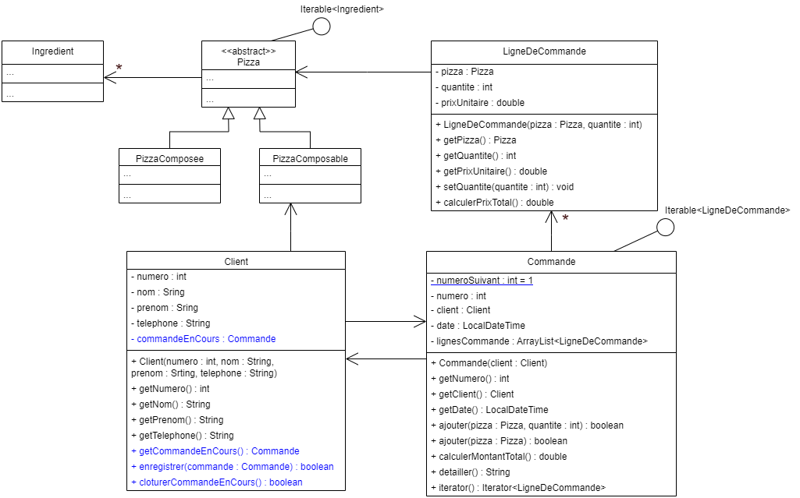

# Atelier 1 : Rappel orienté objet – partie 2

## Objectif

L'objectif de cet atelier est de compléter l'application de pizzeria en ligne en ajoutant la gestion des commandes, des lignes de commande et des associations entre clients, pizzas et commandes.

## Concepts

1. Associations entre objets
2. Collections et parcours avec `Iterator`
3. Encapsulation
4. Constructeurs et attributs statiques
5. Égalité structurelle
6. Gestion d'exceptions simples
7. Dates avec `LocalDateTime`

## Vidéos

1. [Introduction au cours de Java avancé](https://www.youtube.com/watch?v=c69iGzsd1Pc)

## Exercices

### Introduction

Il s'agit de compléter l'application de gestion de commandes de pizzas entamée lors de la séance précédente. Si vous n'avez pas terminé la première partie, vous pouvez récupérer la solution de la séance précédente.

Ci-dessous, se trouve le diagramme de classes complété de l'application. Les classes qui s'y trouvent sont volontairement incomplètes. Dans la classe [`Client`](01-code-java/Client.java), ce qui a été mis en bleu est ce qu'il faut ajouter à celle-ci par rapport à la séance précédente.

### Consignes

Comme à la séance précédente, vous allez devoir implémenter les classes présentées ci-dessus.

Dans IntelliJ, créez un projet intitulé `AJ_atelier01_partie2`. Récupérez les classes fournies dans `01-code-java/` (package par défaut) et mettez-les dans le répertoire `src` de votre projet — c'est l'état où la solution de la partie 1 (`../01-partie1/02-solution/`) vous laisse.

Votre code doit exploiter au mieux les richesses d'une découpe orientée Objet :

1. Les copier-coller sont formellement interdits.
2. Chaque attribut est encapsulé.
3. Chaque objet est responsable de ses propriétés (état et comportement).
4. Le code est réutilisable, lisible et bien structuré (indenté).

Remarque : dans un premier temps, traitez uniquement les cas d'exception demandés.

### La classe `LigneDeCommande`

**Question 1** :

✏️ *A corriger au tableau*

Implémentez la classe `LigneDeCommande` selon le diagramme de classes ci-dessus. Le prix unitaire représente le prix unitaire de la pizza. Il est gardé car, comme les prix peuvent varier au cours du temps, il est important de garder le prix au moment de la commande.

### Associations entre `Commande` et `Client`

Quand on crée une commande pour un client, celle-ci doit automatiquement être enregistrée comme commande en cours de ce client. De ce fait, on ne peut pas créer une commande pour un client s'il a encore une commande en cours, ce qui donne des contraintes supplémentaires au niveau des associations.

**Question 2** :

✏️ *A corriger au tableau*

Commencez par créer la classe `Commande`. Dans un premier temps, ne mettez que les attributs, les getters demandés et la méthode `iterator`.

**Question 3** :
Complétez ensuite la classe `Client` en ajoutant ce qui est mis en bleu dans le diagramme de classes et en tenant compte des remarques suivantes :

1. La méthode `enregistrer` renvoie `false` s'il y a déjà une commande en cours ou si la commande passée en paramètre n'est pas une commande du client. Sinon, elle enregistre la commande passée en paramètre comme commande en cours et renvoie `true`.
2. La méthode `cloturerCommandeEnCours` renvoie `false` s'il n'y a pas de commande en cours. Sinon, elle supprime la commande en cours et renvoie `true`.

**Question 4** :

✏️ *A corriger au tableau*

Ajoutez maintenant le constructeur de la classe `Commande` en tenant compte des remarques suivantes :

1. Le constructeur lance une `IllegalArgumentException` (avec comme message « impossible de créer une commande pour un client ayant encore une commande en cours ») s'il n'est pas possible d'enregistrer une commande pour le client en paramètre. Sinon, il ne faut pas oublier d'enregistrer la commande du côté du client.
2. Le numéro de la commande est attribué automatiquement par la classe (la première commande créée doit avoir le numéro 1, la deuxième le numéro 2, …).
3. La date doit être initialisée à celle de l'instant de la création.

### Suite de la classe `Commande`

**Question 5** :
Ajoutez les méthodes manquantes de la classe `Commande` en tenant compte des remarques suivantes :

1. Les méthodes `ajouter` renvoient `false` si la commande n'est pas la commande en cours du client. Sinon, s'il existe déjà une ligne de commande pour cette pizza, elle modifie cette ligne pour lui ajouter la quantité voulue. Sinon elle crée une nouvelle ligne de commande pour la pizza et l'ajoute. Dans les deux cas, elle renvoie ensuite `true`.
2. Pour la méthode `ajouter` ne recevant pas de quantité en paramètre, il faut ajouter une seule pizza.
3. La méthode `calculerMontantTotal` calcule le montant total de la commande et le renvoie.
4. La méthode `detailler` renvoie, sous forme de chaîne de caractères, toutes les lignes de la commande (une ligne de commande par ligne). Elle doit parcourir les lignes de commande au moyen d'un `foreach`, en s'appuyant sur la méthode `iterator` définie plus haut.

### Égalité structurelle sur les pizzas

On veut que, par défaut, le titre de la pizza permette de l'identifier. Comme deux pizzas composables du même client ont le même titre, c'est, dans ce cas, le titre associé à la date de création qui permet de l'identifier.

**Question 6** :
Ajoutez, dans les classes adéquates, les méthodes nécessaires pour définir ces égalités structurelles.

### Test

Le fichier [`01-code-java/toString_a_copier.txt`](01-code-java/toString_a_copier.txt) contient les méthodes `toString` des classes `LigneDeCommande` et `Commande`. Copiez les `toString` dans les bonnes classes.

La classe [`MenuPizzeria`](01-code-java/MenuPizzeria.java) contient des constantes de type [`PizzaComposee`](01-code-java/PizzaComposee.java) correspondant aux différentes pizzas composées du menu de la pizzeria.

Exécutez la classe [`MainPizzeria`](01-code-java/MainPizzeria.java). Vérifiez que vous avez le bon affichage en comparant avec ce qui est mis dans le fichier `01-code-java/affichage_MainPizzeria.txt`.

## Parties optionnelles

### Historique des commandes d'un client

On veut maintenant garder, pour un client, toutes ses commandes passées. Une commande va être ajoutée aux commandes passées d'un client au moment de sa clôture. De plus, il faut empêcher l'enregistrement d'une commande passée à un client. Il faut aussi pouvoir parcourir toutes les commandes passées du client (au moyen d'un foreach).

**Question 7** :
Implémentez cet historique des commandes passées dans la classe `Client`.

### Possibilité de supprimer des pizzas d'une commande

Il faut maintenant donner la possibilité de retirer des pizzas de la commande. Pour cela, ajoutez, dans la classe `Commande` les méthodes suivantes :

1. `public boolean retirer(Pizza pizza, int quantite)`
  Cette méthode renvoie `false` si la commande n'est pas en cours du client, s'il n'y a pas de ligne de commande concernant la pizza en paramètre dans la commande ou si la quantité de pizza à retirer est strictement supérieure à la quantité commandée. Sinon, si la quantité à retirer est strictement inférieure à la quantité commandée, il faut mettre à jour la quantité de la ligne de commande et, dans le cas où elle est égale, il faut supprimer la ligne de commande ; dans les deux cas, la méthode renvoie ensuite `true`.
2. `public boolean retirer(Pizza pizza)`
  Cette méthode fait la même chose que la méthode précédente avec une quantité à retirer de 1.
3. `public boolean supprimer(Pizza pizza)`
  Cette méthode renvoie `false` si la commande n'est pas en cours du client ou s'il n'y a pas de ligne de commande concernant la pizza en paramètre dans la commande. Sinon, elle retire la ligne de commande concernant la pizza passée en paramètre de la commande et renvoie `true`.

**Question 8** :
Implémentez les méthodes `retirer` et `supprimer` ci-dessus dans la classe `Commande`.

### Test des paramètres des méthodes/constructeurs

Il faut ajouter les tests pour la validité des paramètres des méthodes/constructeurs et lancer une `IllegalArgumentException` en cas de paramètres invalides. Il faut refuser comme paramètre :

1. La valeur `null` lorsqu'il s'agit d'un objet ;
2. Une chaîne de caractères constituée uniquement de « blancs » ;
3. Une liste d'ingrédients vide dans le constructeur de [`Pizza`](01-code-java/Pizza.java) ayant une liste en paramètre ;
4. Un prix inférieur ou égal à 0 ;
5. Une quantité inférieure ou égale à 0.

Vous pouvez utiliser l'interface [`Util`](01-code-java/Util.java) (fournie dans `01-code-java/`) qui offre des méthodes de vérification pour les cas les plus courants.

**Question 9** :
Ajoutez ces tests de validité des paramètres dans les méthodes et constructeurs concernés.

---

*Passez à la [théorie suivante](../../02-collections-enumeres/01-partie1/02A_1_theorie.md).*

*Une remarque ou une erreur repérée ? [Signalez-le ici](https://forms.gle/UhpPjfS36XXmKS2F7).*

*Cheat sheet de cette semaine : [consultez-la en ligne](https://astounding-queijadas-0f428a.netlify.app/01-rappels-fr.html).*

*Cette fiche a été rédigée conjointement avec [Claude Code](https://claude.com/claude-code) et [Codex](https://openai.com/codex).*
