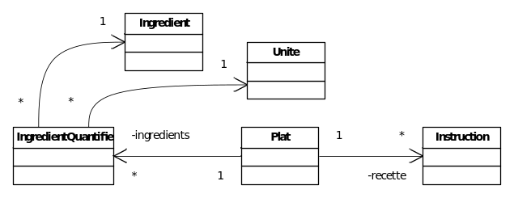

# Atelier 2 : énumérés, collections – partie 1

## Objectif

L'objectif de cet atelier est de construire le socle d'une application de gestion de recettes en utilisant des énumérés, des collections et des classes métier correctement encapsulées. Cette première partie met l'accent sur les unités, les instructions, la structure d'un plat et la préparation du modèle des ingrédients.

## Concepts

1. Énumérés
2. Collections `List` et `Set`
3. Encapsulation
4. Validation des paramètres
5. Exceptions `IllegalArgumentException`
6. Packages
7. Durées avec `Duration`
8. Redéfinition de `toString`
9. Énumérés internes

## Vidéos

1. [Interface Comparable en Java](https://www.youtube.com/watch?v=PCjAg07fivY)
2. [Interface Comparator et classe anonyme en Java](https://www.youtube.com/watch?v=gLTAIkKdsK8)
3. [Clone, copie superficielle et profonde en Java](https://www.youtube.com/watch?v=la-CVGl3k7E)

## Exercices

### Introduction

Il s'agit d'implémenter une application permettant de gérer des recettes de cuisine. L'application doit permettre de gérer les instructions et les ingrédients de la recette.



### Consignes

Vous allez devoir implémenter les classes non fournies du diagramme. Tous les constructeurs et méthodes doivent tester leurs arguments. En cas d'erreur, une exception de type `IllegalArgumentException` se produit. Afin de réaliser ces tests, utilisez l'interface [`Util`](01-code-java/util/Util.java) (package `util`) fournie. Les seules méthodes/constructeurs qui peuvent ne pas tester leurs arguments sont celles pour lesquelles cela n'a aucune importance. Soyez attentifs !

Dans IntelliJ, créez un projet intitulé `AJ_atelier02_partie1`. Récupérez les classes [`Ingredient`](01-code-java/domaine/Ingredient.java), [`IngredientQuantifie`](01-code-java/domaine/IngredientQuantifie.java), [`Main`](01-code-java/main/Main.java) et l'interface `Util` (fournies dans `01-code-java/`) et mettez-les dans les packages adéquats (observez le code afin de trouver les packages adéquats).

À ce stade, il est normal que le projet ne compile pas encore : les fichiers fournis utilisent déjà des éléments que vous allez créer progressivement dans les questions suivantes, notamment l'énuméré `Unite`, la classe `Instruction` et la classe `Plat`.

### L'énuméré `Unite`

**Question 1** :

✏️ *A corriger au tableau*

Commencez par créer, dans le package `domaine`, l'énuméré `Unite`.

Cet énuméré doit contenir les constantes suivantes :

```java
GRAMME, KILOGRAMME, LITRE, MILLILITRE, CENTILITRE, DECILITRE,
CUILLER_A_CAFE, CUILLER_A_THE, CUILLER_A_DESSERT, CUILLER_A_SOUPE,
PINCEE, UN_PEU, NEANT
```

Ajoutez ensuite :

1. Un champ `abreviation`.
2. Un constructeur qui initialise ce champ.
3. Une redéfinition de `toString` qui renvoie l'abréviation.

Les abréviations des constantes sont, dans l'ordre :

```java
"gr", "kg", "l", "ml", "cl", "dl", "cc", "ct", "cd", "cs", "pincée", "peu", ""
```

### La classe `Instruction`

**Question 2** :
Créez, dans le package `domaine`, la classe `Instruction`.

Cette classe garde deux attributs :

1. `description`, de type `String`.
2. `dureeEnMinutes`, de type `Duration`, qui représente le temps nécessaire en minutes pour réaliser l'instruction. Cette durée peut valoir 0.

Ajoutez ensuite :

1. Un constructeur qui reçoit, dans cet ordre :
   - une `String` pour la description ;
   - un `int` pour la durée en minutes.

   Attention : le champ `dureeEnMinutes` est de type `Duration`, pas `int` — regardez les méthodes statiques de `Duration` pour en construire un à partir d'un nombre de minutes.
2. Tous les getters et setters possibles.
3. Une redéfinition de `toString`.

La méthode `toString` doit renvoyer la description de l'instruction précédée de sa durée entre parenthèses, comme dans l'exemple de sortie fourni.

Dans un premier temps, ne vous souciez pas encore de faire apparaître les heures et les minutes sur 2 caractères.

### La classe `Plat`

**Question 3** :

Créez la classe `Plat` dans le package `domaine`. La classe `Plat` définit en interne deux énumérés : `Difficulte` et `Cout`.

#### Énuméré `Difficulte`

✏️ *A corriger au tableau*

L'énuméré `Difficulte` doit :

1. Stocker les constantes `X`, `XX`, `XXX`, `XXXX` et `XXXXX`.
2. Ne garder aucun attribut.
3. Redéfinir `toString` afin d'afficher des `*` à la place des `X`.

#### Énuméré `Cout`

✏️ *A corriger au tableau*

L'énuméré `Cout` doit :

1. Stocker les constantes `$`, `$$`, `$$$`, `$$$$` et `$$$$$`.
2. Redéfinir `toString` afin d'afficher des `€` à la place des `$`.

#### Attributs de `Plat`

`Plat` stocke les champs suivants :

1. `nom`, de type `String`.
2. `nbPersonnes`, de type `int`.
3. `niveauDeDifficulte`, de type `Difficulte`.
4. `cout`, de type `Cout`.
5. `dureeEnMinutes`, de type `Duration`.

De plus, la classe garde deux collections. Respectez bien les rôles présentés dans le diagramme de classes :

1. La première, de type `List`, gardant toutes les instructions de la recette. Le type `List` a été choisi afin de pouvoir facilement garder les instructions dans l'ordre (séquentiel) dans lequel il faut les exécuter.
2. La deuxième, de type `Set`, gardant tous les ingrédients quantifiés de la recette. Ici, l'ordre des ingrédients quantifiés n'a pas d'importance. C'est pourquoi on peut utiliser le type `Set`.

#### Constructeur et getters

Le constructeur de `Plat` prend en paramètres, dans cet ordre :

1. le `nom` ;
2. le `nbPersonnes` ;
3. le `niveauDeDifficulte` ;
4. le `cout`.

La durée en minutes est initialisée à une `Duration` de 0 minute. Elle sera mise à jour dans les méthodes de gestion des instructions (ajout, suppression, ...).

La classe `Plat` fournit des getters triviaux pour le `nom`, le `nbPersonnes`, le `niveauDeDifficulte`, le `cout` et la `dureeEnMinutes`. Il n'y a pas de setter.

#### Gestion des instructions

La gestion des instructions se fait via les méthodes publiques suivantes (les méthodes ayant une position en paramètre lancent une `IllegalArgumentException` si la position passée est inférieure ou égale à 0 ou est trop grande par rapport au nombre d'instructions déjà présentes) :

```java
public void insererInstruction(int position, Instruction instruction)
// insère l'instruction à la position précisée, position commençant à 1.

public void ajouterInstruction(Instruction instruction)
// ajoute l'instruction en dernier.

public Instruction remplacerInstruction(int position, Instruction instruction)
// remplace l'instruction à la position précisée par celle en paramètre.
// renvoie l'instruction qui a été remplacée.

public Instruction supprimerInstruction(int position)
// supprime l'instruction à la position précisée.
// renvoie l'instruction qui a été supprimée.
```

La consultation des instructions peut se faire via la méthode :

```java
public List<Instruction> instructions()
// fournit une collection non-modifiable contenant les instructions du plat considéré.
```

### La méthode `toString` de `Plat`

**Question 4** :
Ajoutez la méthode `toString` dans la classe `Plat` en vous basant sur la solution fournie, tout en mettant en commentaire la partie de cette méthode relative aux ingrédients. Cette partie sera traitée à la question sur la gestion des ingrédients.

### Exécution du programme

**Question 5** :
On vous fournit une classe `Main` (dans `01-code-java/main/`) que vous devez copier dans votre projet (à vous de voir dans quel package la mettre) et exécuter. La sortie de ce programme doit être identique à celle attendue dans `01-code-java/affichage_Main.txt` (excepté le format des durées).

### Gestion des ingrédients dans `Plat`

**Question 6** :
Ajoutons maintenant des fonctionnalités de gestion des ingrédients à la classe `Plat`.

La gestion des ingrédients quantifiés se fait via les méthodes suivantes :

```java
public boolean ajouterIngredient(Ingredient ingredient, int quantite, Unite unite)
// crée un IngredientQuantifie et l'ajoute si l'ingrédient n'est pas encore présent.
// Cela renvoie false si l'ingrédient est déjà présent.

public boolean ajouterIngredient(Ingredient ingredient, int quantite)
// idem précédente. L'unité mise par défaut est NEANT.

public boolean modifierIngredient(Ingredient ingredient, int quantite, Unite unite)
// modifie l'unité et la quantité de l'ingrédient quantifié correspondant
// à l'ingrédient passé en paramètre.
// Renvoie false si l'ingrédient n'est pas présent.

public boolean supprimerIngredient(Ingredient ingredient)
// supprime l'ingrédient quantifié correspondant à l'ingrédient passé en paramètre.
// Renvoie false si l'ingrédient n'est pas présent.

public IngredientQuantifie trouverIngredientQuantifie(Ingredient ingredient)
// renvoie l'ingrédient quantifié correspondant à l'ingrédient.
// Renvoie null si l'ingrédient n'est pas présent.
```

Modifiez la méthode `toString` de la classe `Plat` en dé-commentant la partie relative aux ingrédients afin que cette méthode affiche également les ingrédients d'un plat.

### Test

Exécutez la classe `Main`. La sortie doit correspondre à celle attendue dans `01-code-java/affichage_Main.txt`, à l'ordre des ingrédients près (il dépend du `HashSet` utilisé) et au format des durées près (traité dans les parties optionnelles).

## Parties optionnelles

### Création d'un `SortedSet` en utilisant un `Comparator`

**Question 7** :
Ajoutez, dans la classe `Plat`, la méthode :

```java
public SortedSet<Ingredient> ingredients()
// renvoie l'ensemble des ingrédients, utilisés dans le plat, triés par nom d'ingrédient.
```

Remarque : essayez de le faire avec une classe anonyme pour définir le `Comparator`.

### Formatage de l'affichage des durées

**Question 8** :
Dans la méthode `toString` de la classe `Instruction`, utilisez `String.format` afin d'avoir la durée au format `HH:mm`.

---

*Passez à la [théorie suivante](../02-partie2/02B_1_theorie.md).*

*Une remarque ou une erreur repérée ? [Signalez-le ici](https://forms.gle/UhpPjfS36XXmKS2F7).*

*Cheat sheet de cette semaine : [consultez-la en ligne](https://astounding-queijadas-0f428a.netlify.app/02-collections-enumeres-fr.html).*

*Cette fiche a été rédigée conjointement avec [Claude Code](https://claude.com/claude-code) et [Codex](https://openai.com/codex).*
