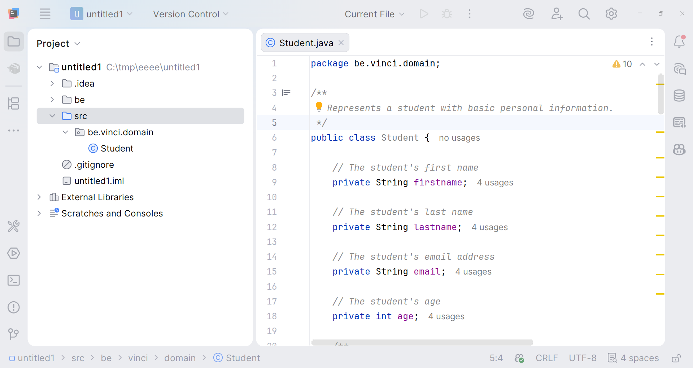
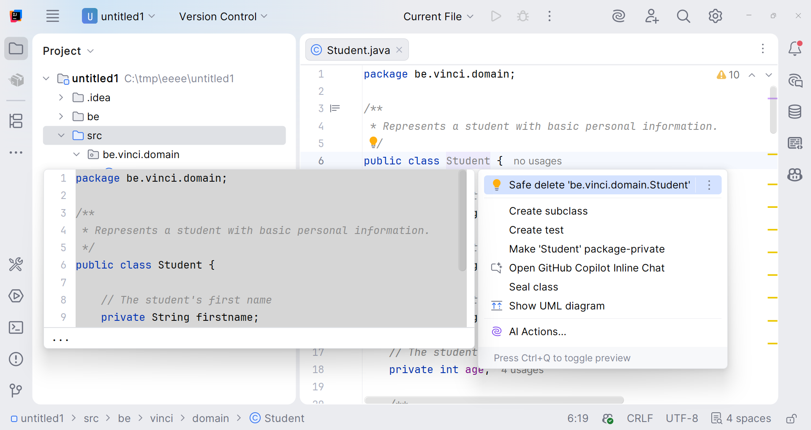
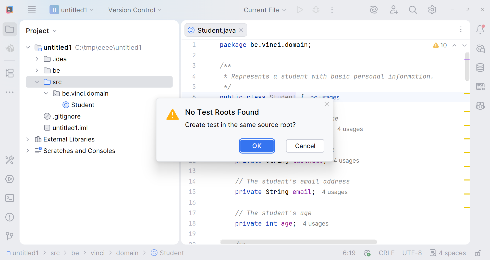
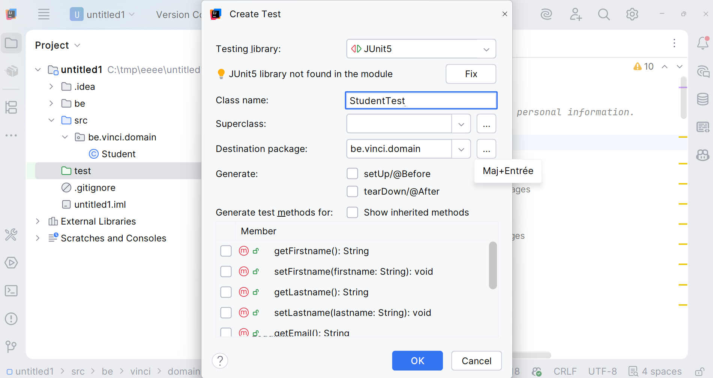
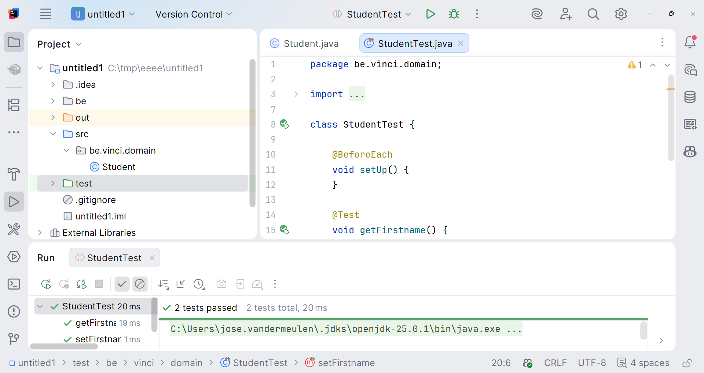

# Atelier 3 : JUnit – partie 1 – Tutoriel : générer une classe de test avec IntelliJ

IntelliJ peut générer automatiquement le squelette d'une classe de test JUnit à partir d'une classe existante. Ce tutoriel montre la procédure pas à pas sur une classe `Student` (exemple générique, transposable à `Prix`, `Produit`, etc.).

## Étape 1 — Se placer dans la classe à tester

Ouvrez la classe à tester (ici `Student.java`).

## Étape 2 — Générer le test

Placez le curseur sur le nom de la classe, puis `Alt+Entrée`. Choisissez **Create test** dans le menu contextuel.

## Étape 3 — Créer la racine de test

Si le projet n'a pas encore de dossier de test, IntelliJ affiche **No Test Roots Found**. Cliquez sur **Cancel** : la création automatique place le dossier au mauvais endroit dans ce projet, mieux vaut le faire soi-même.

Créez alors manuellement le dossier `test` à la racine du projet (à côté de `src`), puis marquez-le comme racine de test : clic droit sur le dossier `test` → `Mark Directory as` → `Test Sources Root`.

Relancez ensuite l'étape 2 (`Alt+Entrée` sur le nom de la classe → **Create test**) : le dossier `test` est maintenant reconnu et la fenêtre **Create Test** s'ouvre directement.

## Étape 4 — Configurer la classe de test

Dans la fenêtre **Create Test** :
- **Testing library** : `JUnit5`.

> [!WARNING]
> Si `JUnit5 library not found in the module` s'affiche, cliquez sur **Fix** pour l'ajouter au projet.

- **Class name** : nom proposé par défaut, `StudentTest` (convention : `<Classe>Test`).
- **Destination package** : identique au package de la classe testée (ici `be.vinci.domain`).
- **Generate** : sélectionnez éventuellement `setUp/@Before` si vous avez besoin d'initialiser des objets avant chaque test.
- **Generate test methods for** : cochez les méthodes à tester (getters/setters, ou toute autre méthode publique).

Cliquez sur **OK**.

## Étape 5 — Compléter et exécuter les tests

IntelliJ crée `StudentTest.java` dans `test/be/vinci/domain/`, avec une méthode `@Test` par méthode sélectionnée. Il ne reste qu'à écrire les assertions (`assertEquals`, `assertThrows`, …), puis lancer la classe de test (bouton ▶ dans la gutter ou clic droit → `Run 'StudentTest'`).

---

*Retour à la [théorie](03A_1_theorie.md).*

*Une remarque ou une erreur repérée ? [Signalez-le ici](https://forms.gle/UhpPjfS36XXmKS2F7).*

*Cheat sheet de cette semaine : [consultez-la en ligne](https://astounding-queijadas-0f428a.netlify.app/03-junit-fr.html).*

*Cette fiche a été rédigée conjointement avec [Claude Code](https://claude.com/claude-code) et [Codex](https://openai.com/codex).*
