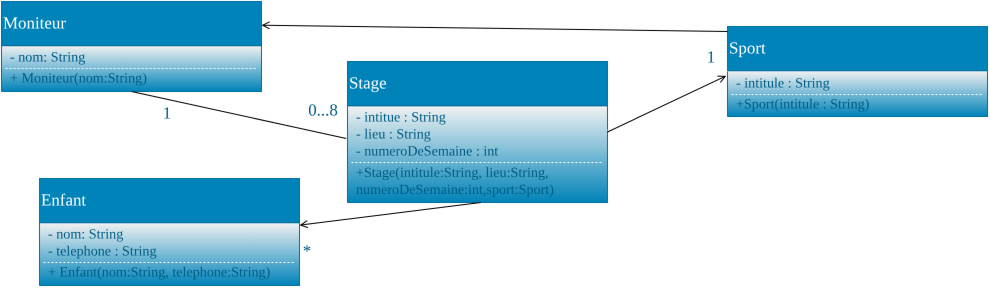

# Atelier 5 : Mocks – partie 1

## Objectif

L'objectif de cet atelier est de tester une classe dépendante d'autres objets en réduisant le couplage grâce aux interfaces et en utilisant des stubs.

## Concepts

1. Interfaces
2. Couplage faible
3. Stubs
4. Tests unitaires
5. Associations entre objets
6. Abstraction des dépendances
7. Organisation des tests avec `@Nested` (vu à l'atelier 3 partie 2)

## Vidéos

1. [Tests unitaires - les stubs](https://www.youtube.com/watch?v=aBwQRyDWl1Y)
2. [Tests unitaires - Mock Objects](https://www.youtube.com/watch?v=d5xIDKCBfyI)
3. [Maven - Mockito](https://www.youtube.com/watch?v=BSIrMuM4UHM)
4. [Tests unitaires - Mockito](https://www.youtube.com/watch?v=oZi6CzLGBY8)

## Exercices

### Introduction

Une ASBL organise des stages sportifs pour les enfants pendant les vacances d'été. Afin de faciliter l'organisation, elle désire se munir d'un logiciel de gestion de ces stages.

L'analyse a déterminé les classes [`Stage`](01-code-java/src/domaine/Stage.java), [`Moniteur`](01-code-java/src/domaine/Moniteur.java) (package `domaine`), [`Sport`](01-code-java/src/domaine/Sport.java), [`Enfant`](01-code-java/src/domaine/Enfant.java) :



En plus des champs liés aux associations, on a que :

1. Un stage stocke un intitulé (« stage d'initiation à la natation »), un lieu (« piscine du Blocry à LLN ») et un numéro de semaine (les semaines de vacances d'été ont été numérotées de 1 à 8).
2. Un moniteur stocke son nom.
3. Un sport stocke son intitulé.
4. Un enfant stocke son nom et son numéro de téléphone.

Une implémentation du domaine est fournie (`01-code-java/`). Elle est commentée en javadoc.

Votre travail aujourd'hui consiste à tester la classe `Moniteur`. Pour des raisons de temps, nous testons uniquement l'association entre la classe `Moniteur` et la classe `Stage` dans le sens Moniteur vers Stage.

### Consignes

Dans IntelliJ, créez un projet intitulé `AJ_atelier05_partie1`. Récupérez les classes fournies dans `01-code-java/src/` (packages `domaine` et `util`) dans un dossier `src` de votre projet, marqué Sources Root.

Créez ensuite un dossier pour les tests :

1. Créez, dans votre projet, un nouveau dossier intitulé `tests` (clic droit sur le projet et choisir New → Directory).
2. Faites un clic droit sur le dossier `tests` et sélectionnez Mark Directory as → Test Sources Root.

Comme à l'atelier 3 partie 2, regroupez vos méthodes de test par thème dans des classes internes `@Nested` (par exemple : ajout valide, suppression, cas de refus), la fixture et le `@BeforeEach` restant sur la classe externe.

### Abstraction de l'implémentation des classes

**Question 1** :

✏️ *A corriger au tableau*

Dans un premier temps, il est demandé de modifier le code afin de limiter le couplage entre les objets. Il s'agit de rendre le code indépendant et maintenable en ne dépendant pas de choix d'implémentation limitatifs. Il faut donc extraire les interfaces de chaque classe du domaine.

Par convention, il est demandé que les interfaces conservent le nom métier : `Stage`, `Sport`, etc. Les classes qui implémentent celles-ci portent le nom de l'interface suivi de `Impl`.

Pour extraire une interface d'une classe avec IntelliJ, veuillez suivre les étapes ci-dessous :

1. faites un clic droit sur le nom de la classe et choisissez Refactor → Extract Interface… ;
2. choisissez « Rename original class and use interface where possible » ;
3. entrez le bon nom pour la classe (nom de l'interface suivi de `Impl`) dans le champ « Rename implementation class to: » ;
4. sélectionnez toutes les méthodes afin qu'elles soient mises dans l'interface ;
5. sélectionnez copy pour que la javadoc soit copiée dans l'interface tout en restant dans la classe ;
6. cliquez sur Refactor.

### Les stubs

Les analystes ont mis en place un diagramme des différents états du `Moniteur`. Ce diagramme est relativement simplifié par le fait que l'état correspond au nombre de stages de celui-ci.

Par exemple, après avoir appelé deux fois, avec succès, la méthode `ajouterStage` sur un moniteur, celui-ci aura donc 2 stages : l'état de ce moniteur sera donc de 2 !

Nous avons choisi de tester uniquement les méthodes `ajouterStage` et `supprimerStage` de la classe `MoniteurImpl`. Il est important de commencer par lire la [JavaDoc de ces deux méthodes](01-code-java/src/domaine/Moniteur.java) (elle se trouve dans la classe `MoniteurImpl`) avant de découvrir leur plan de test.

Plan de tests :

| TC# | État | Méthode | Paramètres | État suivant | Résultat attendu | Valeur retour |
|---|---|---|---|---|---|---|
| 1 | 0 | ajouterStage | stage valide (sport dans lequel le moniteur est compétent, stage sans moniteur) | 1 | Le stage est ajouté | true |
| 2 | 1 | ajouterStage | stage valide semaine libre | 2 | Le stage est ajouté | true |
| 3 | 2 | ajouterStage | stage valide semaine libre | 3 | Le stage est ajouté | true |
| 4 | 3 | ajouterStage | stage valide semaine libre | 4 | Le stage est ajouté | true |
| 5 | 4 | supprimerStage | déjà présent | 3 | Le stage n'est plus présent | true |
| 6 | 3 | supprimerStage | déjà présent | 2 | Le stage n'est plus présent | true |
| 7 | 2 | supprimerStage | déjà présent | 1 | Le stage n'est plus présent | true |
| 8 | 1 | supprimerStage | déjà présent | 0 | Il n'y a plus aucun stage | true |
| 9 | 4 | ajouterStage | stage déjà présent | 4 | stage non ajouté | false |
| 10 | 4 | ajouterStage | semaine déjà prise | 4 | stage non ajouté | false |
| 11 | 4 | supprimerStage | stage non présent | 4 | Tous les stages sont présents, rien n'a été supprimé | false |
| 12 | 4 | ajouterStage | stage possède déjà un autre moniteur | 4 | stage non ajouté | false |
| 13 | 4 | ajouterStage | stage sans moniteur pour un sport pour lequel le moniteur n'est pas compétent | 4 | stage non ajouté | false |

Afin d'implémenter ces tests de façon vraiment unitaire, on va utiliser des stubs. Les tests se trouveront dans le répertoire `tests` créé dans les consignes (marqué comme Test Sources Root).

Créez une classe de tests JUnit `MoniteurImplTest` pour la classe `MoniteurImpl` de cette façon-ci :

1. Ouvrir la classe `MoniteurImpl` que vous voulez tester.
2. Se positionner sur le nom de la classe au sein du code, faire un clic droit et choisir « Show Context Actions ».
3. Choisir « Create Test ».
4. Dans Testing Library, il faut choisir « JUnit5 ». Si le message « JUnit5 library not found in the module » apparaît, cliquez sur Fix et ensuite sur OK.
5. Vérifiez que le package de destination indiqué est bien le même que le package de la classe à tester (package `domaine`).
6. Dans Generate, sélectionnez setUp/@Before.
7. Sélectionnez ensuite les méthodes que vous voulez tester (`ajouterStage` et `supprimerStage`) et cliquez sur OK. Cela devrait générer votre classe de test dans `tests/domaine/MoniteurImplTest`.

Commencez par jeter un œil au code de la première méthode que nous souhaitons tester de façon unitaire : `ajouterStage` de `MoniteurImpl`. Cette méthode reçoit un objet de type `Stage`.

Comme cet objet ne fait pas partie du type de la classe testée, nous découvrons que nous allons devoir prochainement créer un stub pour l'interface `Stage`.

De plus, dans le code de `ajouterStage` de `MoniteurImpl`, on voit que nous allons devoir créer un autre stub. Vous l'avez découvert ?

Voici le code qui répondrait à la question :

```java
if (!stage.getSport().contientMoniteur(this))
```

Comme pour pouvoir ajouter un stage à un moniteur, il faut pouvoir vérifier qu'il est compétent dans le sport du stage et que c'est l'interface `Sport` qui contient une méthode (`contientMoniteur`) permettant de savoir si un moniteur est compétent dans un sport ou non, il faut aussi créer un stub pour l'interface `Sport`. Ce stub vous est déjà fourni à titre d'exemple : récupérez la classe [`SportStub`](01-code-java/tests/domaine/SportStub.java) (fournie dans `01-code-java/tests/domaine/`) et placez-la dans le package `domaine` de votre module de test. Vous pouvez constater que la classe `SportStub` contient un unique attribut (`contientMoniteur`) qui sera initialisé dans le constructeur et que la méthode `contientMoniteur` renvoie la valeur de cet attribut. Ainsi, on pourra, en fonction de l'initialisation, créer un sport dans lequel le moniteur est compétent (`contientMoniteur` vaut `true`) ou non (`false`).

**Question 2** :
Quel est le second stub qu'il faudra créer, en plus de `SportStub` ? Justifiez à partir du code de `ajouterStage` ci-dessus.

Réponses dans [`05A_reponses-observations.md`](05A_reponses-observations.md).

**Question 3** :

✏️ *A corriger au tableau*

Vous devez maintenant écrire le stub `StageStub` pour l'interface `Stage`. Avant d'écrire le stub, il faut déterminer les méthodes pour lesquelles il faut pouvoir configurer le retour. Cela se fait en fonction des tests qu'on désire effectuer. On veut pouvoir créer un stage pour un sport dans lequel le moniteur est compétent ou non, …

Avec IntelliJ, générez le stub `StageStub` pour l'interface `Stage` (une simple classe implémentant `Stage` et définissant déjà toutes ses méthodes) et veillez à ce qu'elle se situe bien dans le package `domaine` du module de tests. De manière analogue à ce qui a été fait dans `SportStub`, vous devrez aussi définir des attributs afin de pouvoir configurer les valeurs de retour des méthodes de la classe `Stage` utilisées pour les tests. En lisant attentivement le plan de tests et le code de la méthode `ajouterStage` de `MoniteurImpl`, on constate qu'il faudra pouvoir configurer les valeurs de retour des méthodes `getNumeroDeSemaine`, `getSport` et `getMoniteur`.

Concernant la redondance, n'y a-t-il pas aussi des objets que vous recréez et utilisez dans différents scénarios de tests ? Par exemple, vous avez besoin d'un moniteur que vous allez utiliser dans chaque scénario de test… N'hésitez pas à créer des attributs et utiliser la méthode `setUp` pour réinitialiser automatiquement ces objets avant chaque test.

**Question 4** :

✏️ *A corriger au tableau*

D'après le plan de tests, les scénarios TC1 à TC4 demandent chacun d'amener d'abord le moniteur à un état donné (0, 1, 2 puis 3 stages déjà présents) en lui ajoutant les mêmes stages, avant de tester l'ajout d'un stage supplémentaire. Plutôt que de dupliquer ce code de préparation dans chaque test, on va d'abord en extraire une méthode.

Écrivez, en haut de votre classe de test, une méthode privée `preparerMoniteurAvecNStages(int nombreDeStages)` qui amène le moniteur à l'état voulu : elle doit lui ajouter `nombreDeStages` stages, un par semaine (semaines 1 à `nombreDeStages`), tous dans un sport où le moniteur est compétent.

**Question 5** :

✏️ *A corriger au tableau*

Écrivez le premier scénario de tests (TC1) correspondant au plan de tests, dans la classe JUnit `MoniteurImplTest`. Nommez votre méthode de test en fonction du cas décrit dans le plan de tests : `testMoniteurTC1`.

Pour chaque scénario suivant, nommez la méthode de test d'après son cas (`testMoniteurTCn`), utilisez `preparerMoniteurAvecNStages` pour amener le `Moniteur` à l'état voulu, et vérifiez que le nouvel état (pour rappel, le nombre de stages) est atteint et que le résultat est bien celui attendu (valeur de retour et effets de l'appel).

**Question 6** :
Écrivez le scénario TC2 (ajout depuis l'état 1).

**Question 7** :
Écrivez le scénario TC3 (ajout depuis l'état 2).

**Question 8** :
Écrivez le scénario TC4 (ajout depuis l'état 3).

### 🤖 À partir d'ici, générez les tests avec l'IA

Les scénarios restants (TC5 à TC13 : suppressions puis cas de refus) suivent tous le même moule que TC1 à TC4 : c'est répétitif, un bon usage de l'IA. Aidez-vous d'un assistant IA (Claude Code, Copilot, …) pour générer ces tests à partir du plan de tests, mais relisez et exécutez chaque test généré, et vérifiez qu'il passe bien au rouge si vous cassez volontairement le code testé.

**Question 9** :

🤖 *À faire avec l'IA*
Écrivez le scénario TC5 (suppression depuis l'état 4).

**Question 10** :

🤖 *À faire avec l'IA*
Écrivez le scénario TC6 (suppression depuis l'état 3).

**Question 11** :

🤖 *À faire avec l'IA*
Écrivez le scénario TC7 (suppression depuis l'état 2).

**Question 12** :

🤖 *À faire avec l'IA*
Écrivez le scénario TC8 (suppression depuis l'état 1).

**Question 13** :

🤖 *À faire avec l'IA*
Écrivez le scénario TC9 (ré-ajout d'un stage déjà présent : refusé).

**Question 14** :

🤖 *À faire avec l'IA*
Écrivez le scénario TC10 (ajout refusé : semaine déjà occupée).

**Question 15** :

🤖 *À faire avec l'IA*
Écrivez le scénario TC11 (suppression refusée : stage absent).

**Question 16** :

🤖 *À faire avec l'IA*
Écrivez le scénario TC12 (ajout refusé : stage appartenant à un autre moniteur).

**Question 17** :

🤖 *À faire avec l'IA*
Écrivez le scénario TC13 (ajout refusé : sport hors compétence).

---

*Passez à la [théorie suivante](../02-partie2/05B_1_theorie.md).*

*Une remarque ou une erreur repérée ? [Signalez-le ici](https://forms.gle/UhpPjfS36XXmKS2F7).*

*Cheat sheet de cette semaine : [consultez-la en ligne](https://astounding-queijadas-0f428a.netlify.app/05-mocks-fr.html).*

*Cette fiche a été rédigée conjointement avec [Claude Code](https://claude.com/claude-code) et [Codex](https://openai.com/codex).*
