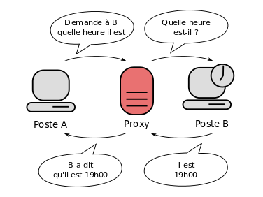

# Atelier 12 : Injection de dépendances – partie 1 – Concepts

## Table des matières

1. [Vidéos](#vidéos)
2. [Introduction](#introduction)
3. [Qu'est-ce qu'un proxy ?](#quest-ce-quun-proxy-)
4. [Le problème : les dépendances concrètes](#le-problème--les-dépendances-concrètes)
5. [Le pattern Factory](#le-pattern-factory)
6. [L'injection de dépendances](#linjection-de-dépendances)

## Vidéos

1. [Interfaces](https://www.youtube.com/watch?v=tLvlrRXwyUk)
2. [Factory method](https://www.youtube.com/watch?v=c7TR0Y_mey8)
3. [Factory Configuration](https://www.youtube.com/watch?v=FdMuh9MQXMI)
4. [Abstract Factory et injection de dépendance via les constructeurs](https://www.youtube.com/watch?v=eZRXt9l4GVM)

## Introduction

L'essentiel de la théorie est dans les vidéos ci-dessus — cette fiche n'en reprend que le fil conducteur et le vocabulaire, après un mot sur le proxy, l'application fil rouge de l'atelier. Les autres notions mobilisées ont déjà leur référence : les requêtes HTTP asynchrones (`HttpClient`, `sendAsync`) sont couvertes par l'atelier 9, l'énuméré interne par l'atelier 2.

## Qu'est-ce qu'un proxy ?

Un proxy est un composant logiciel informatique qui joue le rôle d'intermédiaire en se plaçant entre deux hôtes pour faciliter ou surveiller leurs échanges.

Dans le cadre plus précis des réseaux informatiques, un proxy est alors un programme servant d'intermédiaire pour accéder à un autre réseau, généralement internet. Par extension, on appelle aussi « proxy » un matériel comme un serveur mis en place pour assurer le fonctionnement de tels services.

Source Wikipedia : https://fr.wikipedia.org/wiki/Proxy



Dans le diagramme ci-dessus, le proxy sert d'intermédiaire entre le poste A et le poste B pour leurs discussions. Dès lors, on imagine bien que le proxy est bien placé pour vérifier ce que le poste A demande au poste B.

Il existe des **proxys web** ; ce sont des proxys qui sont programmés pour vérifier les sites web que les clients visitent. Ils permettent de bloquer certains sites, ou certains contenus. Dans ce cas, le client demande au proxy le site web qu'il souhaite visiter. Le proxy vérifie qu'il a bien ce droit. Si oui, alors il fait lui-même la requête, et transmet la réponse au client. Sinon, il répond au client qu'il n'a pas le droit de visiter le site.

## Le problème : les dépendances concrètes

Chaque fois qu'une classe écrit `new AutreClasse()`, elle se lie **en dur** à une implémentation précise : c'est une **dépendance concrète**. Conséquences :

1. impossible de remplacer l'implémentation (par une variante, une version de test, un stub — souvenez-vous de l'atelier 5) sans modifier le code de la classe ;
2. le moindre changement dans la construction de `AutreClasse` (nouveau paramètre...) se propage dans toutes les classes qui font le `new`.

Le remède général : dépendre d'une **interface**, et sortir la responsabilité de créer l'objet hors de la classe qui l'utilise. Deux outils complémentaires pour cela : la factory et l'injection de dépendances.

## Le pattern Factory

Une **factory** est un objet (ou une méthode) dont la seule responsabilité est de créer des instances. Le code client demande « donne-moi un `Query` » sans savoir quelle classe concrète est instanciée :

```java
public interface QueryFactory {
    Query getQuery();
}

public class QueryFactoryImpl implements QueryFactory {
    @Override
    public Query getQuery() {
        return new QueryImpl();   // seul endroit du code qui connaît QueryImpl
    }
}
```

L'implémentation concrète (`QueryImpl`) peut alors devenir invisible hors de son package (visibilité *package-friendly*) : le reste du code ne manipule que l'interface `Query`. Vous utilisez des factory depuis longtemps sans le savoir : `HttpClient.newHttpClient()`, `Executors.newFixedThreadPool(2)`...

## L'injection de dépendances

Reste une question : comment le code client obtient-il la factory elle-même, sans refaire un `new QueryFactoryImpl()` (ce qui recréerait une dépendance concrète) ?

Réponse : il ne la crée pas, il la **reçoit**. C'est l'**injection de dépendances** (*dependency injection*, DI), dans sa forme la plus simple : par le constructeur.

```java
public class ProxyServer {
    private final QueryFactory queryFactory;

    public ProxyServer(QueryFactory queryFactory) {   // la dépendance est injectée
        this.queryFactory = queryFactory;
    }
}
```

Les `new` remontent alors tous au **point d'entrée** du programme, le seul endroit qui connaît les implémentations concrètes :

```java
public static void main(String[] args) {
    QueryFactory queryFactory = new QueryFactoryImpl();
    ProxyServer proxyServer = new ProxyServer(queryFactory);
    proxyServer.startServer();
}
```

Pour remplacer l'implémentation (une factory de test, une variante...), une seule ligne du `main` change — plus rien dans `ProxyServer`. C'est exactement le mécanisme que vous avez pratiqué avec les stubs et mocks de l'atelier 5 (injecter un faux `Hasher` dans `HyperLogLog`...), et c'est le principe de base des frameworks comme Spring, où l'injection est automatisée.

---

*Passez aux [exercices](12A_2_exercices.md).*

*Une remarque ou une erreur repérée ? [Signalez-le ici](https://forms.gle/UhpPjfS36XXmKS2F7).*

*Cheat sheet de cette semaine : [consultez-la en ligne](https://astounding-queijadas-0f428a.netlify.app/12-injection-dependances-fr.html).*

*Cette fiche a été rédigée conjointement avec [Claude Code](https://claude.com/claude-code) et [Codex](https://openai.com/codex).*
