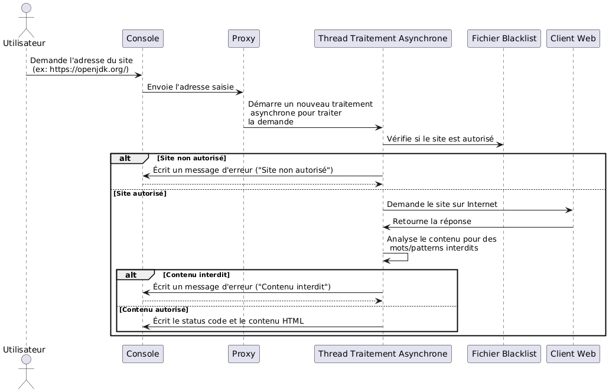

# Atelier 12 : Injection de dépendances – partie 1

## Objectif

L'objectif de cet atelier est de mettre en pratique le pattern **Factory** et l'**injection de dépendances** pour éliminer les dépendances concrètes d'une application réaliste : un proxy web en console, construit de zéro dans un projet Maven. Les requêtes HTTP y sont envoyées de manière asynchrone — une simple mise en pratique de l'atelier 9, plus rien de nouveau sur ce plan.

## Concepts

1. Factory
2. Injection de dépendances
3. Interfaces et dépendances concrètes
4. Classes internes (énuméré interne)
5. Requêtes HTTP (`HttpClient`)
6. Proxy

## Vidéos

1. [Interfaces](https://www.youtube.com/watch?v=tLvlrRXwyUk)
2. [Factory method](https://www.youtube.com/watch?v=c7TR0Y_mey8)
3. [Factory Configuration](https://www.youtube.com/watch?v=FdMuh9MQXMI)
4. [Abstract Factory et injection de dépendance via les constructeurs](https://www.youtube.com/watch?v=eZRXt9l4GVM)

## Exercices

### Introduction

Nous allons aujourd'hui programmer un **proxy web** en version simplifiée — le rôle d'un proxy et son schéma sont expliqués dans la [théorie](12A_1_theorie.md). Nous allons uniquement programmer la partie « Proxy → Poste B » telle que sur le schéma de la théorie, et nous allons faire une interface en console (`System.in`) pour dialoguer avec notre proxy.

Voici le flux global de notre application :

1. On démarre l'application, une console est disponible et nous demande quel site on veut visiter ;
2. On écrit dans la console l'adresse du site, par exemple : https://openjdk.org/ ;
3. Le proxy lit l'adresse dans la console et envoie la requête de manière asynchrone (comme à l'atelier 9) ;
4. Le client web va nous donner la réponse ;
5. Le traitement asynchrone va écrire la réponse dans la console : le « status code » (200, 400…), ainsi que le « content » qui sera généralement du HTML.

Ce flux est représenté ci-dessous :



Une fois l'application fonctionnelle, l'essentiel de l'atelier commence : identifier ses dépendances concrètes, et les éliminer avec une factory puis l'injection de dépendances.

### Consignes

Contrairement aux ateliers précédents, aucun code de départ n'est fourni : vous construisez le projet de zéro (c'est aussi l'occasion de vérifier que vous savez créer un projet Maven sans filet). Dans IntelliJ, créez un nouveau Projet **Maven** nommé `AJ_atelier12_partie1`, avec `be.vinci` comme *GroupId* (voir le [tutoriel Maven](../../05-mocks/02-partie2/05B_3_tutoriel-maven.md) si besoin). Vos sources vont uniquement dans `src/main/java`.

Ne passez pas plus de 15 minutes sur cette mise en place : si votre projet ne compile toujours pas, comparez votre `pom.xml` au [`pom.xml`](01-code-java/pom.xml) fourni dans `01-code-java/` (ou remplacez-le par celui-là) et passez à la suite — l'objectif de l'atelier est l'injection de dépendances, pas la configuration Maven.

Si Maven configure une vieille version de Java, ajoutez dans le `pom.xml`, dans la balise `project`, les properties suivantes (avec la version de Java installée sur votre machine) :

```xml
<properties>
    <maven.compiler.source>21</maven.compiler.source>
    <maven.compiler.target>21</maven.compiler.target>
</properties>
```

Après chaque modification du `pom.xml` : clic droit sur le projet → Maven → *Reload project*. En cas de souci, vérifiez dans *Project Structure* que la version de Java correspond à celle du `pom.xml`.

### Requête HTTP

**Question 1** :

✏️ *A corriger au tableau*

Maintenant que notre projet est prêt, utilisez la documentation du HTTP Client (https://openjdk.org/groups/net/httpclient/intro.html) pour faire une requête GET vers l'URL https://openjdk.org/ et afficher le status code ainsi que le HTML. Veuillez bien faire attention à utiliser la version asynchrone de l'envoi de requêtes présentée dans la documentation (`sendAsync` — vous connaissez les `CompletableFuture` depuis l'atelier 9). Ceci nous permettra de vérifier que nous arrivons à faire des requêtes web et récupérer les informations que nous voulons.

Écrivez votre code dans une classe `Main` dans un package `main`.

Remarquez l'utilisation d'une factory `newHttpClient` pour obtenir une instance de `HttpClient`. Si vous n'avez pas compris qu'il s'agit d'une factory, n'hésitez pas à demander des explications aux professeurs.

Astuces :

1. C'est important de mettre toujours le protocole dans l'URL de la requête : `openjdk.org` ne fonctionne pas, alors que `https://openjdk.org/` fonctionne.

### Lecture au clavier

**Question 2** :
Modifiez votre code pour lire au clavier l'adresse à laquelle doit être faite la requête web.

Pour rappel, voici comment lire au clavier :

```java
Scanner scanner = new Scanner(System.in);
String url = scanner.nextLine();
```

Utilisez un try-with-resources pour ne pas oublier de fermer le scanner.

### Domaine et architecture

Comme nous avons maintenant la certitude de pouvoir faire les requêtes web correctement, et de lire au clavier les URL, structurons notre application.

**Question 3** :
Créez une classe `Query` dans le package `domaine`. Cette classe contient 2 attributs :

1. l'URL de la requête (`String`) ;
2. la "HTTP method" (GET, POST) de type `QueryMethod` (classe interne énuméré).

**Question 4** :
Créez une classe `QueryHandler` dans le package `server` qui possède un attribut de type `Query`. Cette classe s'occupe de faire la requête avec le `HttpClient`, et écrire la réponse à l'écran lors de l'appel de la fonction `sendQueryAndPrintResponse`. Cette fonction envoie la requête avec `sendAsync` et renvoie une `CompletableFuture<Void>`, comme à l'atelier 9 : une requête réseau est lente, on ne bloque pas le thread principal en l'attendant.

Remarque : pour simplifier, le `QueryHandler` ne gère que des query avec la méthode GET.

**Question 5** :
Créez une classe `ProxyServer` dans le package `server` qui va s'occuper de lire au clavier, créer les `Query` et démarrer les `QueryHandler`. Ce comportement est implémenté dans une méthode `startServer`. N'hésitez pas à faire une boucle infinie de type `while (true) { }` pour lire indéfiniment au clavier, tant que l'application est lancée.

Enfin, la méthode `main` de la classe `Main` ne s'occupe maintenant plus que de créer un `ProxyServer`, et appeler sa méthode `startServer`.

Vérifiez que votre projet fonctionne correctement.

### Factory

Maintenant que nous avons une application fonctionnelle et bien structurée, appliquons les concepts vus dans la théorie. On observe une dépendance concrète très forte entre les classes du package `server`, et la classe `Query` : chaque `new Query(...)` lie le serveur à cette implémentation précise.

**Question 6** :
Pour rendre notre code indépendant aux changements, divisons la classe `Query` en une interface `Query` et une classe `QueryImpl`. Pour cela, renommez votre classe `Query` en `QueryImpl`, et utilisez l'outil « Refactor → Extract interface » que vous trouverez en cliquant droit sur la classe `QueryImpl`.

Remarque : résolvez le problème de visibilité de la classe interne énuméré `QueryMethod`.

**Question 7** :
Le package `server` fait encore des `new QueryImpl(...)`. Créez une `QueryFactory` dans le package `domaine`, avec une méthode `getQuery`, et utilisez-la dans le package `server` au lieu du `new` (dépendance concrète). Une fois la factory en place, plus rien hors du package `domaine` ne référence `QueryImpl` : changez sa visibilité en « package-friendly » — comme le montre la théorie, seule l'implémentation de la factory la connaît encore.

Remarque : la factory renvoie des objets « vides », et l'utilisateur de l'objet peut l'initialiser avec les setters.

### Injection de dépendances

**Question 8** :
Reste un dernier `new` suspect : celui de la factory elle-même, dans le package `server`. Mettez en place l'injection de dépendances par le constructeur, telle que vue dans la théorie, pour la `QueryFactory` : dans `ProxyServer`, remplacez la création de la factory par un attribut `final` initialisé via un paramètre du constructeur, puis adaptez le `main` — c'est lui, le point d'entrée, qui crée l'implémentation concrète et l'injecte dans le `ProxyServer`. La théorie montre ce mécanisme pas à pas.

Critère de réussite : plus aucun `new` d'une classe du package `domaine` en dehors du `main` et de la factory, et l'application fonctionne comme avant.

---

*Passez à la [théorie suivante](../02-partie2/12B_1_theorie.md).*

*Une remarque ou une erreur repérée ? [Signalez-le ici](https://forms.gle/UhpPjfS36XXmKS2F7).*

*Cheat sheet de cette semaine : [consultez-la en ligne](https://astounding-queijadas-0f428a.netlify.app/12-injection-dependances-fr.html).*

*Cette fiche a été rédigée conjointement avec [Claude Code](https://claude.com/claude-code) et [Codex](https://openai.com/codex).*
