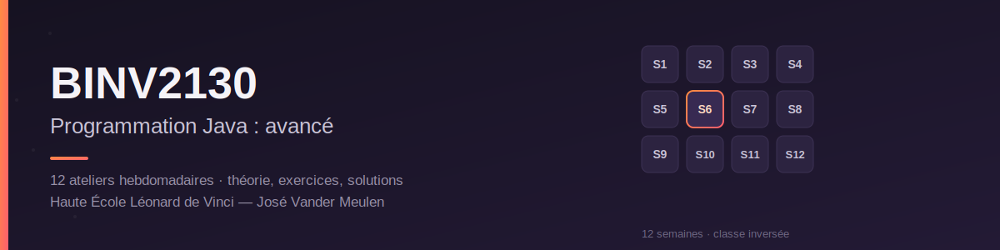
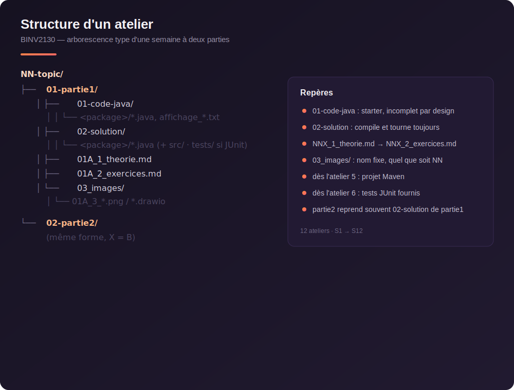

# BINV2130 — Programmation Java : avancé (2026)

Ressources du cours **BINV2130** (Haute École Léonard de Vinci) : théorie, exercices et solutions des ateliers Java hebdomadaires.

**Professeur :** José Vander Meulen

## Organisation

Classe inversée : la théorie de chaque chapitre se prépare en autonomie (fiches, vidéos, codes sources), puis est mise en pratique lors d'une séance d'atelier hebdomadaire de 4h en présentiel. Une solution des exercices est publiée en fin de semaine.

- ▶️ [Playlist YouTube](01-playlist-youtube.md)
- 📅 [Calendrier](00-calendrier.md)
- 📄 [Cheat sheets](cheat-sheets/)

## Chapitres

| # | Thème |
|---|-------|
| 01 | Rappels |
| 02 | Collections et énumérés |
| 03 | JUnit |
| 04 | TDD |
| 05 | Mocks |
| 06 | Streams |
| 07 | Programmation fonctionnelle |
| 08 | Lecture de fichiers |
| 09 | Threads et CompletableFuture |
| 10 | HyperLogLog et asynchrone |
| 11 | Introspection |
| 12 | Injection de dépendances |

Chaque chapitre contient la théorie (`*_1_theorie.md`), les exercices (`*_2_exercices.md`), le code de départ (`01-code-java`), la solution (`02-solution`) et le questionnaire d'auto-évaluation (`NN_quiz.md`).



## Récupérer les ressources

Le dépôt du cours se trouve à l'adresse [https://github.com/josevandermeulen/2026_BINV2130_PJA](https://github.com/josevandermeulen/2026_BINV2130_PJA).

Il évolue tout au long du quadrimestre : les solutions sont publiées semaine après semaine et les documents existants peuvent être corrigés. Plutôt que de retélécharger un ZIP à chaque fois, clonez-le une seule fois et mettez-le à jour au fil des semaines.

En ligne de commande :

```
git clone https://github.com/josevandermeulen/2026_BINV2130_PJA.git
git pull                                              # à refaire chaque semaine
```

Si vous n'êtes pas à l'aise avec Git en ligne de commande, utilisez [GitHub Desktop](https://desktop.github.com/) : *File > Clone repository > URL*, collez l'adresse ci-dessus, choisissez un dossier local et cliquez sur *Clone*. Ensuite, le bouton *Fetch origin* / *Pull origin* suffit pour récupérer les nouveautés.

**Attention : travaillez toujours dans vos propres projets IntelliJ (`AJ_atelierNN_partieX`), en dehors du dossier cloné. Si vous modifiez les fichiers du dépôt, la prochaine mise à jour entrera en conflit avec vos changements.**

## Évaluation

- **Examen (90 %)** : examen sur machine en janvier, portant sur des exercices pratiques de programmation. Il pourra également comporter des questions de théorie tirées de la banque décrite ci-dessous. Accès aux supports et à la Javadoc. IA générative interdite. Mêmes modalités en seconde session.
- **Évaluation continue (10 %)** : les QCM hebdomadaires sur mooVin, sans points négatifs. La note est calculée sur les **10 meilleurs résultats des 12 QCM** ; un QCM non réalisé est coté 0. Cette note ne peut faire l'objet ni d'une seconde session ni d'une remédiation : celle du premier quadrimestre est reportée telle quelle en seconde session.

Un QCM de 20 questions par chapitre est proposé sur mooVin, portant sur la théorie de la semaine. Il **ferme le mercredi à 20h**. Le questionnaire est ensuite publié dans ce dépôt (`NN_quiz.md`, à la racine du chapitre) le mercredi à partir de 20h15, avec les bonnes réponses et leur justification. Ces QCM forment aussi une **banque de questions** dans laquelle l'examen pourra puiser : les travailler au fil des semaines est directement utile pour l'examen.

## Feedback

Votre retour sur le cours est le bienvenu. Trois canaux existent :

1. **Directement au professeur** — venez lui parler pendant ou après une séance, ou envoyez-lui un mail. C'est le canal le plus rapide et le plus efficace.
2. **Le conseil de département** — vos délégués y relaient les remarques de la classe. Il ne se réunit qu'une fois, au milieu du quadrimestre : utile pour les questions de fond, mais peu réactif.
3. **Le questionnaire en ligne** — [remplissez-le ici](https://forms.gle/UhpPjfS36XXmKS2F7). Vous choisissez d'y répondre de manière anonyme ou non.

## Licence

Ce matériel est publié sous licence [CC BY-NC-SA 4.0](LICENSE) (Attribution, pas d'utilisation commerciale, partage dans les mêmes conditions).
